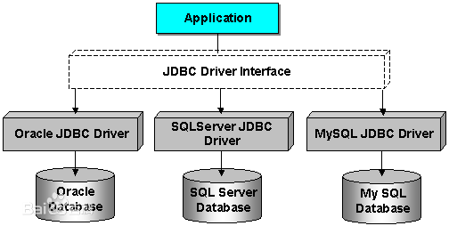
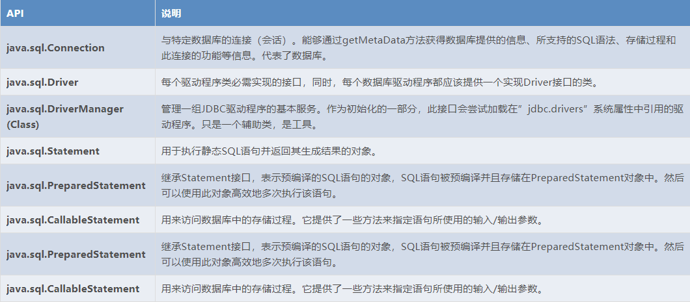
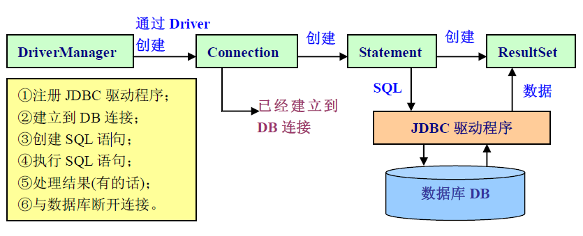
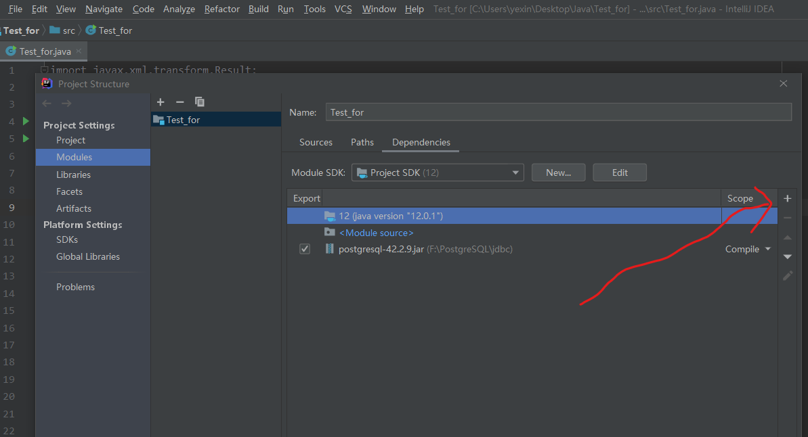
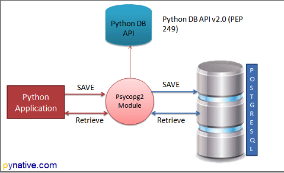

# 如何使用Java和python连接数据库

## <font color=orange>一、使用Java连接数据库</font>

#### <font color=green>1、了解JDBC：</font>

在使用java链接数据库之前需要下载JDBC(Java Database Connectivity)，它是应用(编程语言)与数据库相连的驱动，或者可以说它是两者连接的桥梁，它向上层的编程语言提供的接口，一套完整的、允许便捷式访问底层数据库的Java API。
<center>


</center>

[postgresql的jdbc驱动下载链接](https://jdbc.postgresql.org/download.html)，直接选择最近发布的版本即可。


#### <font color=green>2、常用的接口：</font>

Java API提供了对JDBC的管理链接，Java Driver API支持JDBC管理到驱动器连接

其中：

    DriverManager：这个类管理数据库驱动程序的列表，查看加载的驱动是否符合Java Driver API的规范
    Connnection：与数据库中的所有的通信的唯一连接对象
    Statement：把创建的SQL对象，转而存储到数据库当中
    ResultSet：它是一个迭代器，用于检索查询数据

详细的信息如下所示：
<center>


</center>


#### <font color=green>3、使用JDBC访问数据库的基本步骤：</font>

    1. 准备工作（创建相关类、准备相关的数据库信息包括url、user和密码等）
    2. 载入JDBC驱动程序
    3. 创建数据库连接
    4. 执行SQL语句，获取或者更新数据库中的数据
    5. 结果处理
    6. 关闭连接释放资源

<center>


</center>

#### <font color=green>4、通过代码展示操作流程</font>

```Java{.line-numbers}
/*
*文件名称：DB_Connect.java
*/
import java.sql.*;

public class DB_Connect{
    public static void main(String[] args) throws Exception{
        //1、准备工作，创建好相关类对象
        Connection con;
        Statement st;
        ResultSet rs;

        String url="jdbc:postgres://localhost:5432/fund_name";
        //url的格式：jdbc:postgresql:(协议)<IP地址>:<端口号>/fund_name
        String user="postgres";
        String password="password";

        //2、加载驱动
        Class.forName("org.postgres.Driver");

        //3、建立连接
        con=DriverManager.getConnection(url,user,password);
        st=con.createStatemet();//获得连接的Statement对象

        //4、执行SQL，获得数据库中的数据或者更新数据(更新、删除需要用到方法st.executeUpdate(sql语句))
        rs=st.executeQuery("select product_id,product_name from product;");

        //5、对结果进行操作
        whiel(rs.next()){//获得记录是以一条一条记录行的形式进行保存的，所以可以通过next()方法操作一个
        //游标从第一条记录行开始进行读取，知道读取到最后一条记录行
            System.out.println(rs.getString("product_id")+", "+rs.getString("product_name"));
        }

        //6、关闭连接释放资源
        rs.close();
        st.close();
        con.close();
    }
}
```

#### <font color=green>5、执行该Java程序时需要注意的事项：</font>

1）需要注意的是在编写好程序之后，如果不是使用IDE的话，需要在编译后的执行时通过命令行增加参数选项的方式指定JDBC驱动文件，如下所示：

    javac DB_Connect.java  //进行编译，与平常并没有什么差别
    java -cp 驱动文件所在的文件夹路径\jdbc\*;. DB_Connect   
                            //其中的*使得jdbc中的所有文件都被包含进入，
                            //;是包含多个路径是的分隔符
                            //.表示当前文件夹
                            //这个-cp实际上就是在指定类路径，它指出了程序所用到的类是位于哪一个地方

2）如果使用Intellij Idea作为IDE进行java编程，那么就需要在创建java项目之后再file——>Project Structrue——>Modules——>Dependencies右边的加号"+"中将需要使用的JDBC驱动文件添加到库中，然后编写程序（当然这个程序编写先后没什么问题），最后完成后编译执行，这样就不用像命令行一样需要通过指定参数的方式就可以执行了，如下图：
<center>


</center>

## <font color=orange>二、使用Python连接数据库</font>

#### <font color=green>1、了解psycopg2库</font>

psycopg2是python语言中对于postgresql的数据库接口，具体的详细用法和说明可以在[spycopg2的官方文档](http://initd.org/psycopg/docs/)中查看(具体用法点击第二部分的Basic module usage查看)，本文档只是对其用法进行简单的说明。其连接作用和实现效果如图：
<center>


</center>

安装该库，可以通过在cmd中使用如下命令进行安装：`pip install psycopg2`

在编写python代码连接postgresql数据库时，需要导入该库：
```python
import psycopg2
```

#### <font color=green>2、相关类和方法的介绍</font>

##### **2.1、connection类**
该类封装了数据库连接会话，具体该类的介绍见[官方关于connection类的文档](http://initd.org/psycopg/docs/connection.html#connection)

    其中方法connect()创建了一个新的数据库连接会话，并返回一个connection对象。它的参数包括：
    1）dbname-数据库名字
    2）user-数据库用户
    3）password-数据库用户密码
    4）host-数据库地址
    5）port-端口

对于一个connection对象具有如下常见的方法：

    1）cursor()：它会创建一个cursor类，使用该类可以执行SQL语句和查询等工作
    2）commit()：提交任何未提交的事务到数据库
    3）rollback()：回滚
    4）关闭数据。如果关闭数据库时，仍有未提交的事务，这回执行回滚操作

##### **2.2、cursor类**
该类对象用来在数据库中以迭代的方式执行数据库命令。这个可以参考Java中的游标，实际上cursor的中文意思就是游标，在Java中我们通过对获取的数据以代码`rs.next()`逐行游标的方式获取记录行,在python中获取数据行的方法也是通过这种类似的方法。具体的cursor类介绍见[官方关于cursor类的文档](http://initd.org/psycopg/docs/cursor.html#cursor)。
    
常用的API：

    1）connection.cursor()：通过作用于一个connection类对象从而创建一个新的cursor类对象
    2）close()：关闭cursor对象
    
    用于sql命令执行的方法：
    1）execute(query,,vars=None)：用于执行sql语句，sql语句以字符串的形式放在括号里面
    2）executemany(query,vars_list)：用于批量执行sql语句，具体可以参考下面中指出的文章链接

    用于数据库查询命令后的结果获取方法，这些方法都需要在一个execute()方法被调用之后才能够读取到数据：
    1）fetchone()：该方法获取查询结果集中的下一行记录（最开始时读第一行），知道结果集中没有了数据记录
    2）fetchmany([size=cursor.arraysize])：该方法获取查询结果集中多个记录行，并以元组列表的形式返回
    3）fetchall()：该方法获取查询结果集中的所有记录行，并以元组列表的形式返回

    当然还有一些其他的方法比如官方文档中提到的COPY-related methods等方法我具体就不说了

一些特别的用法：
1、execute()方法支持字符串/字符串列表对SQL语句进行填充,如下所示：
```python
cur.execute("insert into database_name * values (%s,%s)",([string_1,string_2]))
#在这个%s的位置，后面参数中的元组中的字符串对该位置进行填充，然后执行sql语句。这种方法从用于批量执行sql语句的场
#景也就是上面提到过的fetchmany()，不过更多的用法可以查看官方文档。特别注意的是第二个参数是元组！！

```
2、由于cursor对象是以迭代的方式执行，所以我们如果想一行一行读取记录的话并不需要使用循环下的fetchone()方法，而可以通过一个for循环完成，如下所示：
```python{.line-numbers}
cur.execute("sql语句")
for record in cur:
    print(record)#当然这里可以换成想要的对记录行的操作
```

上面提到的文章：
[关于executemany()方法的文章](https://blog.csdn.net/lsr40/article/details/83537974)

#### <font color=green>3、操作流程</font>

1. 链接postgresql数据库，创建游标cursor类对象
2. 执行sql语句
3. 获取查询结果/当然这一步可能没有
4. 提交事务，关闭连接释放资源

#### <font color=green>4、通过代码展示操作流程</font>

```python{.line-numbers}
'''
文件名称：DB_Connect.py
'''
import psycopg2

#1、连接数据库，创建connection对象
conn=psycopg2.connect(dbname="database_name",user="postgres",host="localhost",
#2、创建cursor对象
port="5432",password="password")
cur=conn.cursor()

#3、执行sql语句，并对获得的数据进行处理
cur.execute("sql语句")

'''不适用fetch方法'''
for record in cur:
    product_id.append(record[0])
    prodcut_name.append(record[1])
    product_type.append(record[2])
    #虽然cur每读取一行就会返回元组tuple，每一个元组上包含了每一列名下的值，可以通过下标的形式进行访问

'''使用fetchone()方法'''
record=cur.fetchone()#不过这个方法只会获得一行记录，要想读取多行需要使用多次的fetchone()

'''使用fetchmany()方法'''
arraysize=5
records=cur.fetchmany(arraysize)
for record in records:
    product_id.append(record[0])
    product_id.append(record[1])
    #等等

'''使用fetchall()方法'''
records=cur.fetchall()

#3、提交事务，关闭连接
conn.commit()
cur.close()
conn.close()

```

## <font color=orange>三、补充知识</font>

#### <font color=green>3.1、使用datetime库</font>

由于在自己的程序中经常使用到日期（sql中的日期格式为2020-01-23这种形式），所以需要用到datetime这个库，具体怎么用这个库我也不多解释，还是见官方文档的[技术手册](https://docs.python.org/zh-cn/3/library/datetime.html#datetime.datetime)吧,也可以直接参考下网上的一篇[网文](https://www.cnblogs.com/huigebj/p/11259449.html)

我只举例一个如何得到当天的日期，以2020-01-23的形式：
```python{.line-numbers}
from datetime import date
from datetime import datetime

'''第一种方法'''
current_date=date.today().isoformat()
'''第二种方法'''
current_date=datetime.now().date()

```